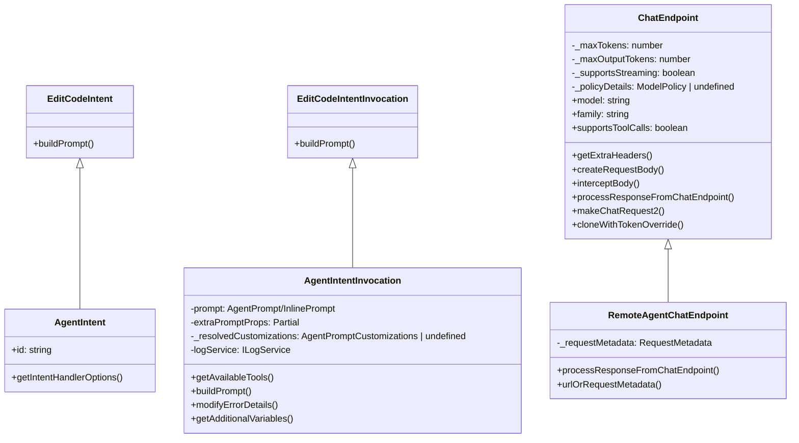
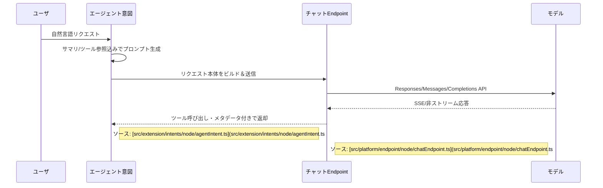
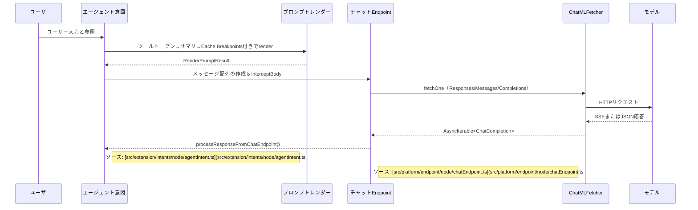

# User
- エージェントのチャットリクエスト（ユーザ入力）からプロンプト生成、送信、LLM 応答の受信までのフローを調査するよう依頼した。
- その調査結果を元に、クラス図・シーケンス図を含む視覚的な要約を生成するよう求めた。
- 本会話の要約と図を `livind_doc/agentintent.md` に書き込むよう指示した。

# Assistant
- `AgentIntent` によるツール選定とプロンプト構築、`ChatEndpoint` による API リクエスト作成・送信・レスポンス処理という 2 層の主要フローを説明した（[src/extension/intents/node/agentIntent.ts](src/extension/intents/node/agentIntent.ts#L51-L327)、[src/platform/endpoint/node/chatEndpoint.ts](src/platform/endpoint/node/chatEndpoint.ts#L112-L392)）。
- エージェント意図とチャットエンドポイントの仕組みを可視化した Mermaid 図を提示した。

- note right of AgentIntent : ソース: [src/extension/intents/node/agentIntent.ts](src/extension/intents/node/agentIntent.ts#L126-L327)
- note right of ChatEndpoint : ソース: [src/platform/endpoint/node/chatEndpoint.ts](src/platform/endpoint/node/chatEndpoint.ts#L112-L392)

# Files
- [src/extension/intents/node/agentIntent.ts](src/extension/intents/node/agentIntent.ts#L51-L327) - エージェント Intent におけるツール制御、プロンプト構築、キャッシュサマリ処理を担当。
- [src/platform/endpoint/node/chatEndpoint.ts](src/platform/endpoint/node/chatEndpoint.ts#L112-L392) - モデル向けリクエスト本文の組立て、エンドポイント分岐、レスポンス処理を担うチャットエンドポイント。
