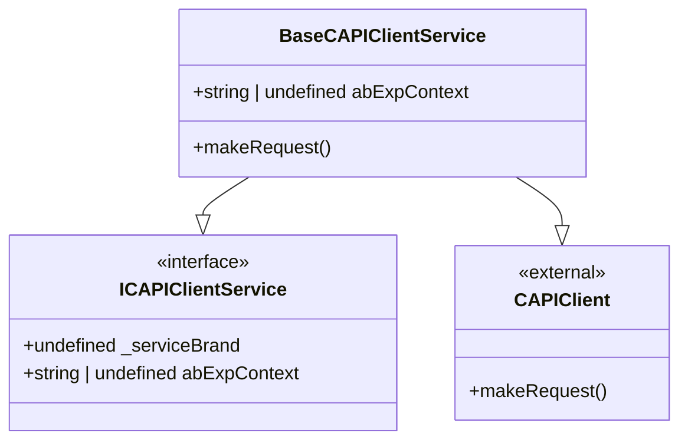
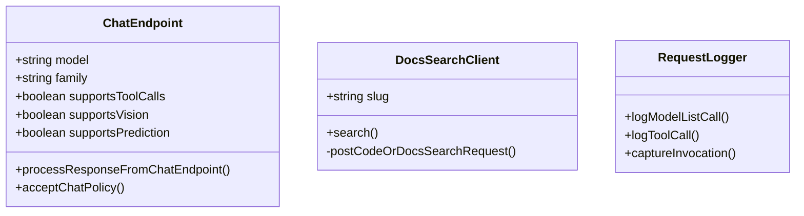
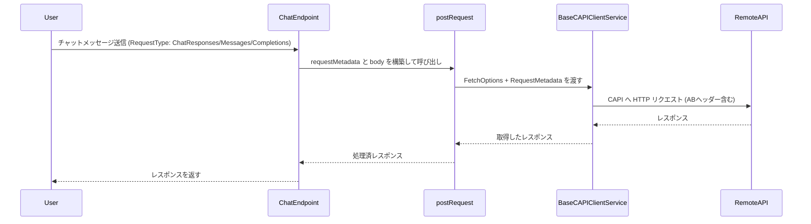

# CAPI（@vscode/copilot-api）調査まとめ

## User

- リポジトリ内 (`src` 以下) での `@vscode/copilot-api` の使われ方を調査すること。
- `@vscode/copilot-api` 本体のソースは直接読まない（ライセンス遵守）。
- 調査対象は `src` 以下全般。
- その調査結果を元に、クラス図とシーケンス図（Mermaid）を作成すること。
- 生成した図はドキュメントに埋め込むこと。

## Assistant

以下は、`src` 以下を調査した結果の要約と、作成した Mermaid 図です。

### 要約

- `BaseCAPIClientService` は外部の `CAPIClient` をラップし、リクエスト送信前に AB テスト用ヘッダー (`VScode-ABExpContext`) を注入する役割を持ちます（`makeRequest` をオーバーライド）。参照: [src/platform/endpoint/common/capiClient.ts](src/platform/endpoint/common/capiClient.ts#L6-L49)
- ネットワーキング層では `RequestMetadata` / `RequestType` を用いてどの内部 API（chat/completions/responses/など）に送るかを決定しています。`postRequest` / `getRequest` は最終的に `BaseCAPIClientService.makeRequest` または `IFetcher` を経由して HTTP を実行します。参照: [src/platform/networking/common/networking.ts](src/platform/networking/common/networking.ts#L147-L212)
- `ChatEndpoint` はモデルメタデータに基づいて `urlOrRequestMetadata` を返し、`RequestType.ModelPolicy` などのメタでポリシー承諾やモデル別 API を呼び分けます。参照: [src/platform/endpoint/node/chatEndpoint.ts](src/platform/endpoint/node/chatEndpoint.ts#L183-L189) および [src/platform/endpoint/node/chatEndpoint.ts](src/platform/endpoint/node/chatEndpoint.ts#L314-L339)
- Docs 検索、コード検索、チャンク化、埋め込み、Snippy 等の各機能は、`RequestType` を含む `RequestMetadata` を付けて `postRequest` / `BaseCAPIClientService` 経由で呼び出されます。代表例:
  - Docs 検索: [src/platform/remoteSearch/node/codeOrDocsSearchClientImpl.ts](src/platform/remoteSearch/node/codeOrDocsSearchClientImpl.ts#L165-L212)
  - GitHub Code Search: [src/platform/remoteCodeSearch/common/githubCodeSearchService.ts](src/platform/remoteCodeSearch/common/githubCodeSearchService.ts#L269-L296)
  - Chunking: [src/platform/chunking/common/chunkingEndpointClientImpl.ts](src/platform/chunking/common/chunkingEndpointClientImpl.ts#L344-L374)
  - Remote Embeddings: [src/platform/embeddings/common/remoteEmbeddingsComputer.ts](src/platform/embeddings/common/remoteEmbeddingsComputer.ts#L78-L99)
  - Snippy: [src/platform/snippy/common/snippyFetcher.ts](src/platform/snippy/common/snippyFetcher.ts#L25-L36)
- `RequestLogger` はモデル一覧取得で `RequestMetadata` を受け取りログに含めるなど、どのエンドポイントに対する呼び出しかを記録できる仕組みです。[src/platform/requestLogger/node/requestLogger.ts](src/platform/requestLogger/node/requestLogger.ts#L234-L257)

---

### Mermaid: クラス図（分割）

参照元（クラス情報）: [src/platform/endpoint/common/capiClient.ts](src/platform/endpoint/common/capiClient.ts#L6-L49), [src/platform/endpoint/node/chatEndpoint.ts](src/platform/endpoint/node/chatEndpoint.ts#L112-L189), [src/platform/remoteSearch/node/codeOrDocsSearchClientImpl.ts](src/platform/remoteSearch/node/codeOrDocsSearchClientImpl.ts#L52-L212), [src/platform/requestLogger/node/requestLogger.ts](src/platform/requestLogger/node/requestLogger.ts#L234-L257)

---

### Mermaid: シーケンス図

参照: `postRequest`/`getRequest` の流れは [src/platform/networking/common/networking.ts](src/platform/networking/common/networking.ts#L147-L212) を参照。

---

## 参照したファイル一覧と短い説明

- [src/platform/endpoint/common/capiClient.ts](src/platform/endpoint/common/capiClient.ts#L6-L49) — `CAPIClient` をラップする `BaseCAPIClientService`（AB ヘッダー注入）。
- [src/platform/networking/common/networking.ts](src/platform/networking/common/networking.ts#L147-L212) — `postRequest`/`getRequest`、`IEndpoint` と `RequestMetadata` の取り扱い。
- [src/platform/endpoint/node/chatEndpoint.ts](src/platform/endpoint/node/chatEndpoint.ts#L112-L189) — `ChatEndpoint` の URL/RequestMetadata 選定と `acceptChatPolicy` の実装。
- [src/platform/remoteSearch/node/codeOrDocsSearchClientImpl.ts](src/platform/remoteSearch/node/codeOrDocsSearchClientImpl.ts#L52-L212) — Docs 検索クライアント（`RequestType.SearchSkill` を使用）。
- [src/platform/remoteCodeSearch/common/githubCodeSearchService.ts](src/platform/remoteCodeSearch/common/githubCodeSearchService.ts#L269-L296) — GitHub のコード検索（`RequestType.EmbeddingsCodeSearch` 等）。
- [src/platform/chunking/common/chunkingEndpointClientImpl.ts](src/platform/chunking/common/chunkingEndpointClientImpl.ts#L344-L374) — チャンク取得/埋め込み関連の `postRequest` 呼び出し。
- [src/platform/embeddings/common/remoteEmbeddingsComputer.ts](src/platform/embeddings/common/remoteEmbeddingsComputer.ts#L78-L99) — リモート埋め込み呼び出し（`RequestType.DotcomEmbeddings` / CAPI 埋め込みの分岐）。
- [src/platform/snippy/common/snippyFetcher.ts](src/platform/snippy/common/snippyFetcher.ts#L25-L36) — Snippy 呼び出し（`RequestType.SnippyMatch` 等）。
- [src/extension/prompts/node/panel/toolCalling.tsx](src/extension/prompts/node/panel/toolCalling.tsx#L367-L387) — ツール結果の画像取り扱いで `RequestType.ChatCompletions` を判定する箇所。
- [src/platform/requestLogger/node/requestLogger.ts](src/platform/requestLogger/node/requestLogger.ts#L234-L257) — リクエストログの実装（`RequestMetadata` を扱う）。

---

必要なら、このドキュメントにさらに詳細（図の拡張、追加のサービスフロー、各 `RequestType` 別のルーティング表など）を追加します。どの箇所を深掘りしますか？

