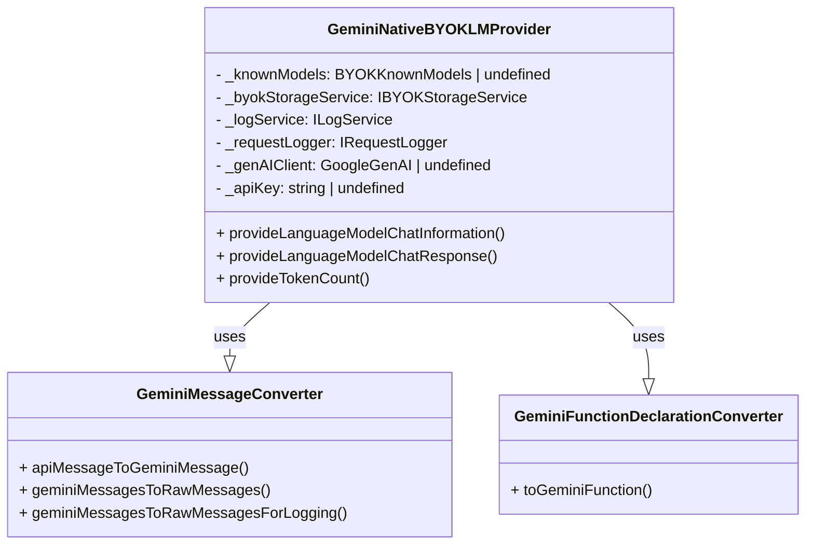
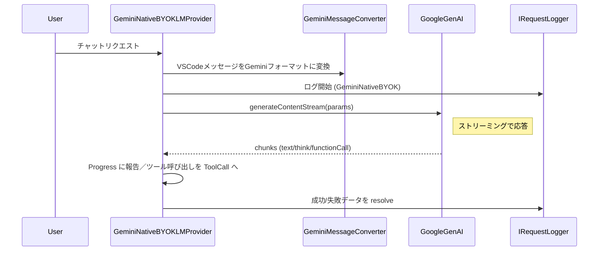
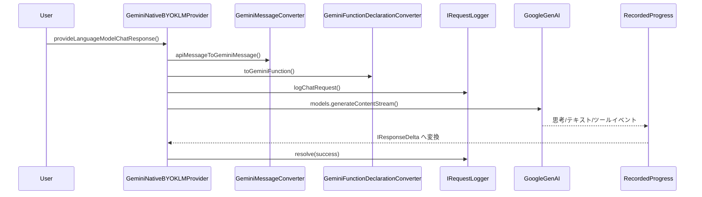

# Gemini 連携まとめ

## User
- Gemini LLM を使用するとき、どこで `@google/genai` パッケージを使用し、どこで独自実装しているかを徹底的に調査してほしい。
- Gemini 関連の動作を可視化する Mermaid 図（classDiagram と sequenceDiagram）を作成してほしい。
- 上記要約を `#file:gemini.md` に書いて保存してほしい。

## Assistant

- 調査結果（要約）
	- `@google/genai` は主に `GeminiNativeBYOKLMProvider` 内で直接利用されている。
		- `GoogleGenAI` クライアントを API キーで初期化する。
		- `models.list()` で利用可能モデルを列挙する。
		- `models.generateContentStream()` を呼んでストリーミング応答を取得する。
		- 型（`GenerateContentParameters`, `Tool`, `Type`, `Content`, `FunctionDeclaration` など）を参照している。
		- 参照箇所: [src/extension/byok/vscode-node/geminiNativeProvider.ts](src/extension/byok/vscode-node/geminiNativeProvider.ts#L6-L26)

	- Gemini 固有のメッセージ変換・ツール宣言変換・ログ化は独自実装されている。
		- `apiMessageToGeminiMessage`, `geminiMessagesToRawMessages`, `geminiMessagesToRawMessagesForLogging`（`geminiMessageConverter.ts`）で、VS Code の `LanguageModelChatMessage` と Gemini の `Content` を相互変換するロジックを持つ。
		- `toGeminiFunction`（`geminiFunctionDeclarationConverter.ts`）で、VS Code/JSON スキーマから Gemini の関数宣言に変換する。
		- これらは `@google/genai` の型を利用しつつもデータ変換の実装は独自である（例: ツール結果の分離、画像の base64 埋め込み、system 指示の切り出し 等）。
		- 参照箇所: [src/extension/byok/common/geminiMessageConverter.ts](src/extension/byok/common/geminiMessageConverter.ts#L11-L21), [src/extension/byok/common/geminiFunctionDeclarationConverter.ts](src/extension/byok/common/geminiFunctionDeclarationConverter.ts#L6-L20)

	- 主なクラスと責務（簡易）
		- `GeminiNativeBYOKLMProvider`
			- インスタンス変数: `_genAIClient: GoogleGenAI | undefined`, `_apiKey: string | undefined`, `_knownModels`, `_byokStorageService`, `_logService`, `_requestLogger`
			- 主要メソッド: `provideLanguageModelChatInformation()`, `provideLanguageModelChatResponse()`, `provideTokenCount()`
		- `GeminiMessageConverter`
			- 主要メソッド: `apiMessageToGeminiMessage()`, `geminiMessagesToRawMessages()`, `geminiMessagesToRawMessagesForLogging()`
		- `GeminiFunctionDeclarationConverter`
			- 主要メソッド: `toGeminiFunction()`

- 処理フロー（概略）
	1. VS Code 側から `provideLanguageModelChatResponse()` が呼ばれる。
	2. `apiMessageToGeminiMessage()` でメッセージを Gemini フォーマットに変換。
	3. 必要に応じて `toGeminiFunction()` でツール定義を Gemini 用に変換。
	4. `GoogleGenAI.models.generateContentStream()` を呼び、ストリーミングでチャンクを受信。
	5. チャンクを解析して `LanguageModelTextPart` / `LanguageModelThinkingPart` / `LanguageModelToolCallPart` 等に変換し進捗報告。
	6. ログは `IRequestLogger.logChatRequest()` と `resolve()` を通じて記録される。

- テスト・検証
	- 変換ロジックにはユニットテストが存在する（`src/extension/byok/common/test/` 以下の `*.spec.ts`）。変更時はテストを更新してカバレッジを保つこと。

---

## Mermaid 図（会話中に生成した図）

### クラス図

ソース: [src/extension/byok/vscode-node/geminiNativeProvider.ts](src/extension/byok/vscode-node/geminiNativeProvider.ts#L22-L295), [src/extension/byok/common/geminiFunctionDeclarationConverter.ts](src/extension/byok/common/geminiFunctionDeclarationConverter.ts#L6-L120), [src/extension/byok/common/geminiMessageConverter.ts](src/extension/byok/common/geminiMessageConverter.ts#L11-L305)

### シーケンス図（簡易）

### シーケンス図（詳細）

## 参照ファイル一覧
- [src/extension/byok/vscode-node/geminiNativeProvider.ts](src/extension/byok/vscode-node/geminiNativeProvider.ts#L22-L295) — Gemini の BYOK ネイティブプロバイダー。`GoogleGenAI` クライアントを初期化し、`models.list()` や `models.generateContentStream()` を呼ぶ。
- [src/extension/byok/common/geminiMessageConverter.ts](src/extension/byok/common/geminiMessageConverter.ts#L11-L305) — VS Code 型と Gemini 型の相互変換ロジック（ツールコール/ツール結果/画像処理 等）。
- [src/extension/byok/common/geminiFunctionDeclarationConverter.ts](src/extension/byok/common/geminiFunctionDeclarationConverter.ts#L6-L120) — JSON スキーマ → Gemini 関数宣言変換ロジック。
- [src/extension/byok/common/test/geminiMessageConverter.spec.ts](src/extension/byok/common/test/geminiMessageConverter.spec.ts) — 変換ロジックのユニットテスト（参照）。
- [src/extension/byok/common/test/geminiFunctionDeclarationConverter.spec.ts](src/extension/byok/common/test/geminiFunctionDeclarationConverter.spec.ts) — 関数宣言変換のユニットテスト（参照）。
- [package.json](package.json) — `@google/genai` が依存関係として含まれている。

