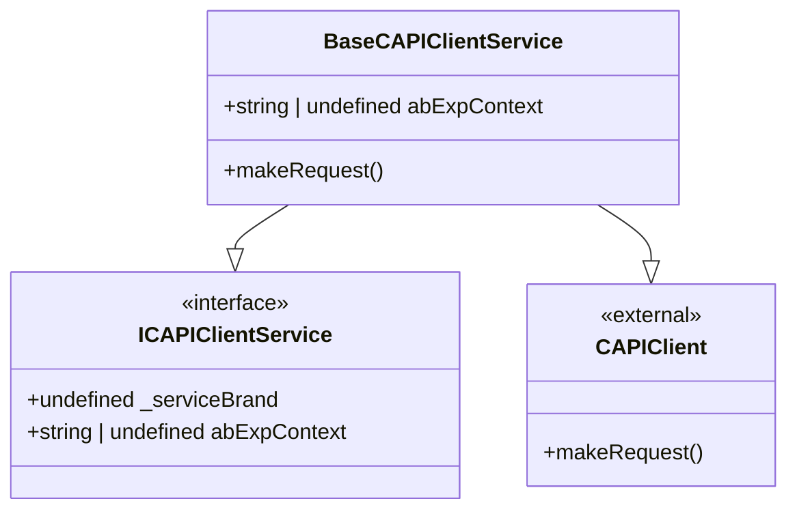
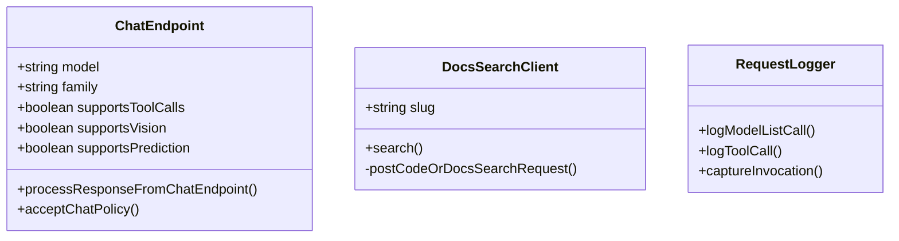
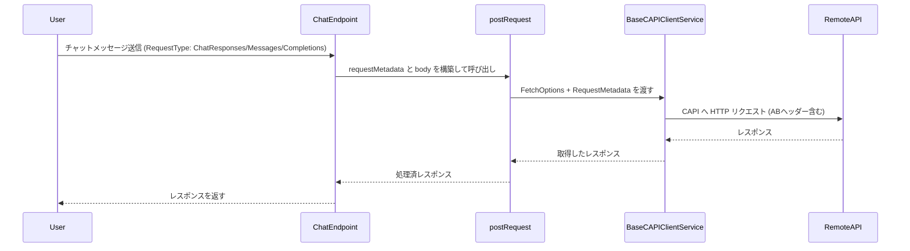
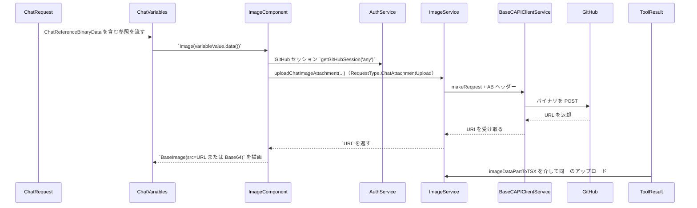

# CAPI（@vscode/copilot-api）調査まとめ

## User

- リポジトリ内 (`src` 以下) での `@vscode/copilot-api` の使われ方を調査すること。
- `@vscode/copilot-api` 本体のソースは直接読まない（ライセンス遵守）。
- 調査対象は `src` 以下全般。
- その調査結果を元に、クラス図とシーケンス図（Mermaid）を作成すること。
- 生成した図はドキュメントに埋め込むこと。

## Assistant

以下は、`src` 以下を調査した結果の要約と、作成した Mermaid 図です。

### 要約

- `BaseCAPIClientService` は外部の `CAPIClient` をラップし、リクエスト送信前に AB テスト用ヘッダー (`VScode-ABExpContext`) を注入する役割を持ちます（`makeRequest` をオーバーライド）。参照: [src/platform/endpoint/common/capiClient.ts](src/platform/endpoint/common/capiClient.ts#L6-L49)
- ネットワーキング層では `RequestMetadata` / `RequestType` を用いてどの内部 API（chat/completions/responses/など）に送るかを決定しています。`postRequest` / `getRequest` は最終的に `BaseCAPIClientService.makeRequest` または `IFetcher` を経由して HTTP を実行します。参照: [src/platform/networking/common/networking.ts](src/platform/networking/common/networking.ts#L147-L212)
- `ChatEndpoint` はモデルメタデータに基づいて `urlOrRequestMetadata` を返し、`RequestType.ModelPolicy` などのメタでポリシー承諾やモデル別 API を呼び分けます。参照: [src/platform/endpoint/node/chatEndpoint.ts](src/platform/endpoint/node/chatEndpoint.ts#L183-L189) および [src/platform/endpoint/node/chatEndpoint.ts](src/platform/endpoint/node/chatEndpoint.ts#L314-L339)
- Docs 検索、コード検索、チャンク化、埋め込み、Snippy 等の各機能は、`RequestType` を含む `RequestMetadata` を付けて `postRequest` / `BaseCAPIClientService` 経由で呼び出されます。代表例:
  - Docs 検索: [src/platform/remoteSearch/node/codeOrDocsSearchClientImpl.ts](src/platform/remoteSearch/node/codeOrDocsSearchClientImpl.ts#L165-L212)
  - GitHub Code Search: [src/platform/remoteCodeSearch/common/githubCodeSearchService.ts](src/platform/remoteCodeSearch/common/githubCodeSearchService.ts#L269-L296)
  - Chunking: [src/platform/chunking/common/chunkingEndpointClientImpl.ts](src/platform/chunking/common/chunkingEndpointClientImpl.ts#L344-L374)
  - Remote Embeddings: [src/platform/embeddings/common/remoteEmbeddingsComputer.ts](src/platform/embeddings/common/remoteEmbeddingsComputer.ts#L78-L99)
  - Snippy: [src/platform/snippy/common/snippyFetcher.ts](src/platform/snippy/common/snippyFetcher.ts#L25-L36)
- `RequestLogger` はモデル一覧取得で `RequestMetadata` を受け取りログに含めるなど、どのエンドポイントに対する呼び出しかを記録できる仕組みです。[src/platform/requestLogger/node/requestLogger.ts](src/platform/requestLogger/node/requestLogger.ts#L234-L257)

---

### Mermaid: クラス図（分割）

参照元（クラス情報）: [src/platform/endpoint/common/capiClient.ts](src/platform/endpoint/common/capiClient.ts#L6-L49), [src/platform/endpoint/node/chatEndpoint.ts](src/platform/endpoint/node/chatEndpoint.ts#L112-L189), [src/platform/remoteSearch/node/codeOrDocsSearchClientImpl.ts](src/platform/remoteSearch/node/codeOrDocsSearchClientImpl.ts#L52-L212), [src/platform/requestLogger/node/requestLogger.ts](src/platform/requestLogger/node/requestLogger.ts#L234-L257)

---

### Mermaid: シーケンス図

参照: `postRequest`/`getRequest` の流れは [src/platform/networking/common/networking.ts](src/platform/networking/common/networking.ts#L147-L212) を参照。

## チャット添付画像の処理

### 添付データの取り込み
- ユーザーがチャットリクエストに画像を添付すると `vscode.ChatPromptReference#value` に [ChatReferenceBinaryData](src/extension/vscode.proposed.chatBinaryReferenceData.d.ts#L11-L33) が保持され、`renderChatVariables` では `variableValue instanceof ChatReferenceBinaryData` を判定した上で `Image` 要素を生成して `variableValue.data()` で取得した `Uint8Array` をそのまま渡します。[src/extension/prompts/node/panel/chatVariables.tsx](src/extension/prompts/node/panel/chatVariables.tsx#L180-L214)
- `Image` 要素は `PromptElement` であり、視覚対応エンドポイント (`supportsVision`) 以外では参照情報だけを出し、対応する場合は `BaseImage` で画像 (`imageSource`) を描画します。[src/extension/prompts/node/panel/image.tsx](src/extension/prompts/node/panel/image.tsx#L39-L90)

### GitHub経由のアップロードと CAPI 連携
- `Image` はまず `Uint8Array` から Base64 に変換し、`RequestType.ChatCompletions` の CAPI に対するリクエストかつ `ConfigKey.EnableChatImageUpload` が有効で (`modelCanUseImageURL(this.promptEndpoint)` が `true`) のときのみアップロードを試みます。[src/extension/prompts/node/panel/image.tsx](src/extension/prompts/node/panel/image.tsx#L39-L90)
- アップロード処理は `authService.getGitHubSession('any', { silent: true })` で GitHub トークンを取り、そのトークン＋ `getMimeType` で推定した MIME タイプを渡して `IImageService.uploadChatImageAttachment` を呼び出します。このサービスは `RequestType.ChatAttachmentUpload` を使って `ICAPIClientService.makeRequest` 経由で `BaseCAPIClientService` に送信し、画像を GitHub に送った後の URL を `URI.parse(result.url)` で受け取ります。[src/platform/image/common/imageService.ts](src/platform/image/common/imageService.ts#L9-L23)、[src/platform/image/node/imageServiceImpl.ts](src/platform/image/node/imageServiceImpl.ts#L11-L51)、[src/util/common/imageUtils.ts](src/util/common/imageUtils.ts#L103-L116)
- `ImageServiceImpl` は `mimeType` と `token` がなければ例外を投げ、ファイル名を英数字＋`._-` 以外を除去して拡張子がないときは MIME から補完します。CAPI リクエストでは `Content-Type: application/octet-stream`、`Authorization: Bearer <token>`、`RequestType.ChatAttachmentUpload` とともにバイナリを送信し、失敗すると例外を投げて呼び出し元でベース64にフォールバックします。[src/platform/image/node/imageServiceImpl.ts](src/platform/image/node/imageServiceImpl.ts#L11-L51)
- アップロードに失敗したりトークン/実験フラグが揃わないときや、モデルが画像 URL を受け付けない (`modelCanUseImageURL` が `false`) 場合は `BaseImage` に Base64 文字列を与えて描画し、警告ログを出して対応します。[src/extension/prompts/node/panel/image.tsx](src/extension/prompts/node/panel/image.tsx#L57-L90)

### ツール出力画像の同様のパス
- ツール呼び出しの `onImage` でも同じ `EnableChatImageUpload` フラグと `modelCanUseMcpResultImageURL` を確認し、許可されていれば `authService.getGitHubSession` で取得したトークンを `imageDataPartToTSX` に渡します。[src/extension/prompts/node/panel/toolCalling.tsx](src/extension/prompts/node/panel/toolCalling.tsx#L525-L545)
- `imageDataPartToTSX` は画像データを Base64 文字列にし、CAPI `RequestType.ChatCompletions` であれば `imageService.uploadChatImageAttachment` を呼び出して同様に URL を取得。失敗時はベース64へフォールバックするため、ツール画像もユーザーに表示できます。[src/extension/prompts/node/panel/toolCalling.tsx](src/extension/prompts/node/panel/toolCalling.tsx#L367-L386)

### モデル依存の制約
- `modelCanUseImageURL` は `model.family` が `gemini` 系でないかつ隠し `HiddenModelF` でないモデルを `true` にします。これにより Gemini 系モデルや過去の `HiddenModelF` では画像 URL を送らずベース64のままとなります。[src/platform/endpoint/common/chatModelCapabilities.ts](src/platform/endpoint/common/chatModelCapabilities.ts#L161-L194)
- MCP ツール結果の画像はさらに厳しく、Anthropic 系、`gemini` 系、`HiddenModelE/F` を除外する `modelCanUseMcpResultImageURL` の判定を通ったときだけアップロードします。対応しないモデルでは画像 URL を含めず `imageDataPartToTSX` が Base64 を返します。[同上]

---

## 参照したファイル一覧と短い説明

- [src/platform/endpoint/common/capiClient.ts](src/platform/endpoint/common/capiClient.ts#L6-L49) — `CAPIClient` をラップする `BaseCAPIClientService`（AB ヘッダー注入）。
- [src/platform/networking/common/networking.ts](src/platform/networking/common/networking.ts#L147-L212) — `postRequest`/`getRequest`、`IEndpoint` と `RequestMetadata` の取り扱い。
- [src/platform/endpoint/node/chatEndpoint.ts](src/platform/endpoint/node/chatEndpoint.ts#L112-L189) — `ChatEndpoint` の URL/RequestMetadata 選定と `acceptChatPolicy` の実装。
- [src/platform/remoteSearch/node/codeOrDocsSearchClientImpl.ts](src/platform/remoteSearch/node/codeOrDocsSearchClientImpl.ts#L52-L212) — Docs 検索クライアント（`RequestType.SearchSkill` を使用）。
- [src/platform/remoteCodeSearch/common/githubCodeSearchService.ts](src/platform/remoteCodeSearch/common/githubCodeSearchService.ts#L269-L296) — GitHub のコード検索（`RequestType.EmbeddingsCodeSearch` 等）。
- [src/platform/chunking/common/chunkingEndpointClientImpl.ts](src/platform/chunking/common/chunkingEndpointClientImpl.ts#L344-L374) — チャンク取得/埋め込み関連の `postRequest` 呼び出し。
- [src/platform/embeddings/common/remoteEmbeddingsComputer.ts](src/platform/embeddings/common/remoteEmbeddingsComputer.ts#L78-L99) — リモート埋め込み呼び出し（`RequestType.DotcomEmbeddings` / CAPI 埋め込みの分岐）。
- [src/platform/snippy/common/snippyFetcher.ts](src/platform/snippy/common/snippyFetcher.ts#L25-L36) — Snippy 呼び出し（`RequestType.SnippyMatch` 等）。
- [src/extension/prompts/node/panel/toolCalling.tsx](src/extension/prompts/node/panel/toolCalling.tsx#L367-L387) — ツール結果の画像取り扱いで `RequestType.ChatCompletions` を判定する箇所。
- [src/platform/requestLogger/node/requestLogger.ts](src/platform/requestLogger/node/requestLogger.ts#L234-L257) — リクエストログの実装（`RequestMetadata` を扱う）。
- [src/extension/prompts/node/panel/chatVariables.tsx](src/extension/prompts/node/panel/chatVariables.tsx#L180-L214) — `ChatReferenceBinaryData` を拾って `Image` 要素へ渡すロジック。
- [src/extension/vscode.proposed.chatBinaryReferenceData.d.ts](src/extension/vscode.proposed.chatBinaryReferenceData.d.ts#L11-L33) — VS Code 側の `ChatReferenceBinaryData` 定義（`mimeType` や `data()` を公開）。
- [src/extension/prompts/node/panel/image.tsx](src/extension/prompts/node/panel/image.tsx#L39-L90) — `supportsVision`/`RequestType.ChatCompletions`/`EnableChatImageUpload` を検証して GitHub へアップロードする `Image` コンポーネント。
- [src/platform/image/common/imageService.ts](src/platform/image/common/imageService.ts#L9-L23) — `IImageService.uploadChatImageAttachment` のインターフェース定義。
- [src/platform/image/node/imageServiceImpl.ts](src/platform/image/node/imageServiceImpl.ts#L11-L51) — トークン・MIME チェック、ファイル名の正規化、`RequestType.ChatAttachmentUpload` 付き POST、GitHub から返された URL を `URI.parse` して返す実装。
- [src/util/common/imageUtils.ts](src/util/common/imageUtils.ts#L103-L116) — Base64 文字列から MIME タイプを推定する `getMimeType`。
- [src/platform/endpoint/common/chatModelCapabilities.ts](src/platform/endpoint/common/chatModelCapabilities.ts#L161-L194) — `modelCanUseImageURL`/`modelCanUseMcpResultImageURL` によるモデルごとの画像 URL 制限。
- [src/extension/prompts/node/panel/toolCalling.tsx](src/extension/prompts/node/panel/toolCalling.tsx#L525-L545) — ツール画像のアップロード可否判定と GitHub トークン取得。

---

必要なら、このドキュメントにさらに詳細（図の拡張、追加のサービスフロー、各 `RequestType` 別のルーティング表など）を追加します。どの箇所を深掘りしますか？

