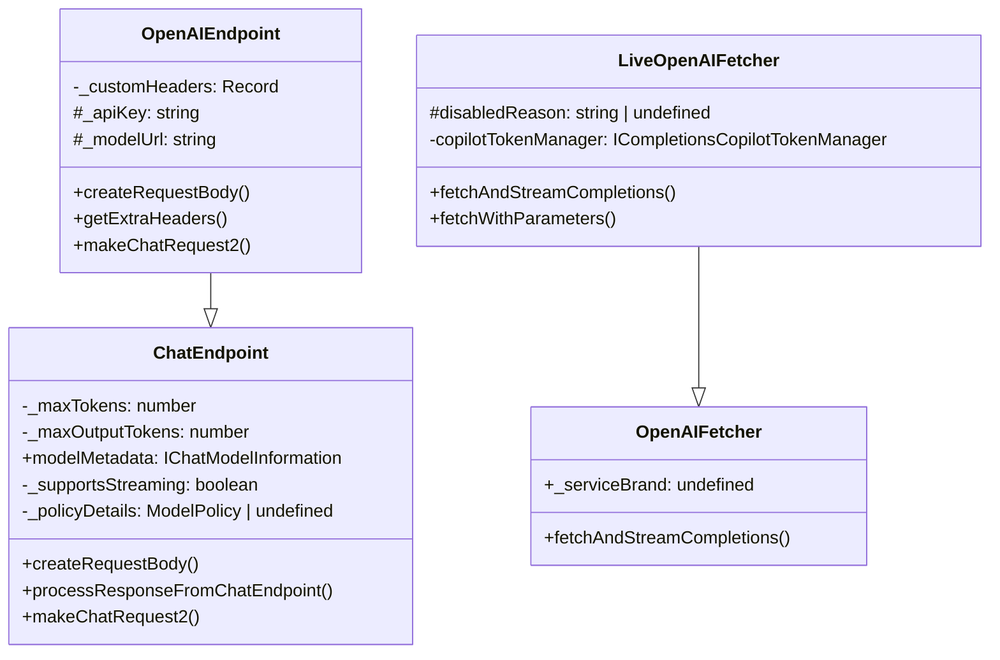
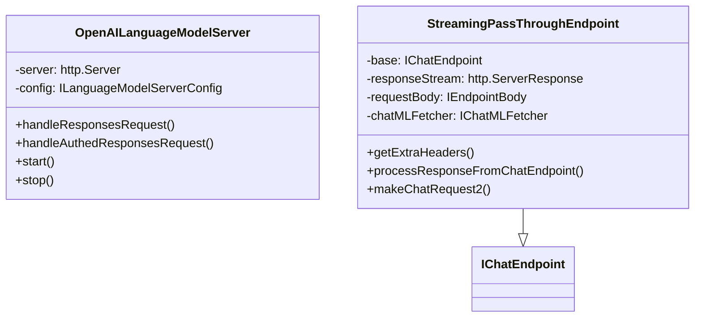
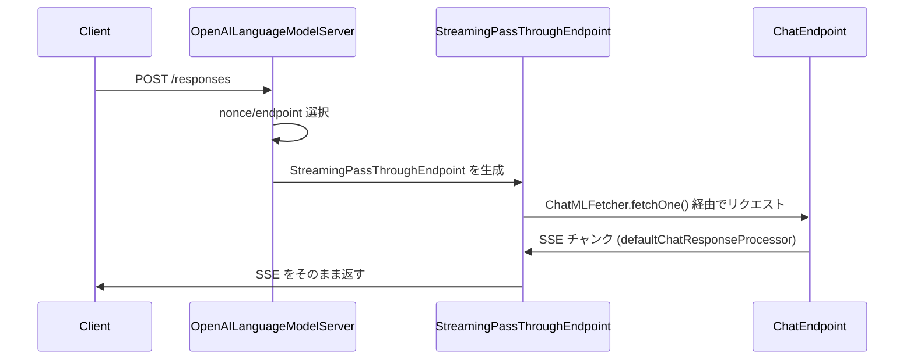
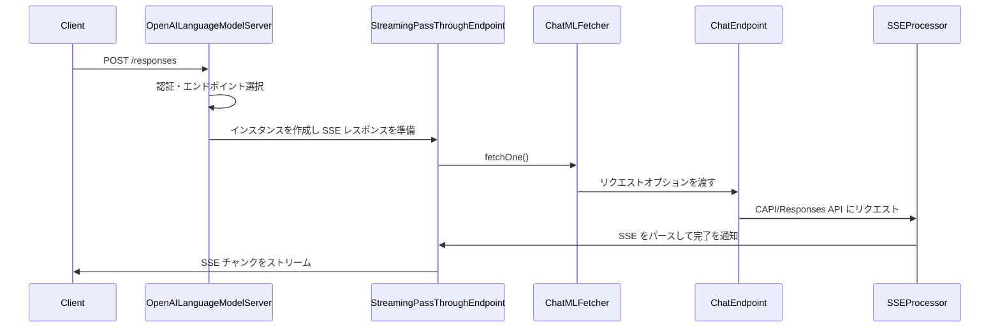

# ChatEndpoint 調査まとめ

## User
- OpenAI の npm パッケージを使わずに OpenAI 互換の LLM 用コードを独自実装している点について、コードベースを徹底的に調査してほしい。
- 調査結果をもとに Mermaid 図（classDiagram と sequenceDiagram）を作成してほしい。
- 作成した要約と図をこのファイルに保存してほしい。

## Assistant
以下はワークスペース内の該当実装を調査してまとめた要約と図です。

### 要約（簡潔）
- コアのメッセージ/型定義は `src/platform/networking/common/openai.ts` にあり、Raw.ChatMessage を CAPI 互換に変換するユーティリティや ChatCompletion / FilterReason などを定義している。
- チャットエンドポイント基底は `ChatEndpoint`（`src/platform/endpoint/node/chatEndpoint.ts`）で、モデルメタデータを保持し、CAPI / Responses / Messages API 用のリクエストボディ生成やレスポンス処理の分岐を提供する。
- OpenAI BYOK 用の `OpenAIEndpoint`（`src/extension/byok/node/openAIEndpoint.ts`）は `ChatEndpoint` を継承し、ヘッダーのサニタイズ、Responses/CAPI 用 body のカスタマイズ、トークン/認可ヘッダ処理を実装している。
- 補完（completions）は Copilot プロキシ経由で独自に `CompletionRequest` を組み、SSE ストリームを受けて `LiveOpenAIFetcher`（`src/extension/completions-core/vscode-node/lib/src/openai/fetch.ts`）が処理する。OpenAI の公式 npm はネットワーク層で使われておらず、独自の HTTP/SSE クライアント実装で完結している。
- OpenAI Responses API 互換のローカル LM サーバ `OpenAILanguageModelServer`（`src/extension/externalAgents/node/oaiLanguageModelServer.ts`）は、外部から `/responses` を受け取り `StreamingPassThroughEndpoint` を経由して内部の `IChatEndpoint` に転送し、SSE をクライアントにそのまま返すプロキシを実装している。

---

### Mermaid 図 — クラス図（チャットエンドポイント周り）

### Mermaid 図 — クラス図（LM サーバ周り）

### Mermaid 図 — シーケンス図（簡略版）

### Mermaid 図 — シーケンス図（フル）

---

## 参照ファイル
- [src/platform/endpoint/node/chatEndpoint.ts](src/platform/endpoint/node/chatEndpoint.ts): チャットエンドポイント基底。CAPI/Responses/Messages 切替、レスポンス処理、トークナイザ取得。
- [src/platform/networking/common/openai.ts](src/platform/networking/common/openai.ts): Raw -> CAPI 変換や ChatCompletion 型、FilterReason 等の共通定義。
- [src/extension/byok/node/openAIEndpoint.ts](src/extension/byok/node/openAIEndpoint.ts): OpenAI BYOK 向けの `OpenAIEndpoint` 実装（ヘッダサニタイズ、body カスタマイズ）。
- [src/extension/externalAgents/node/oaiLanguageModelServer.ts](src/extension/externalAgents/node/oaiLanguageModelServer.ts): OpenAI Responses 互換のローカル LM サーバと `StreamingPassThroughEndpoint`。
- [src/extension/completions-core/vscode-node/lib/src/openai/fetch.ts](src/extension/completions-core/vscode-node/lib/src/openai/fetch.ts): `LiveOpenAIFetcher` と補完用の SSE フェッチパイプライン。
