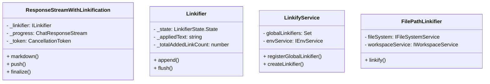
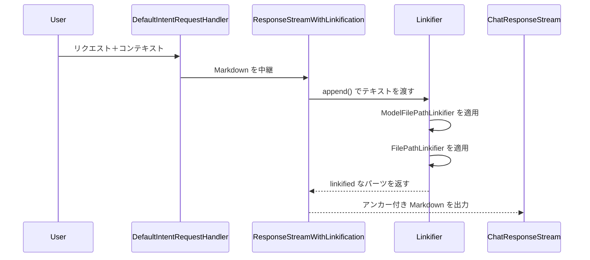

- **LLM側の責任**: プロンプトでは `FileLinkificationInstructions` でファイル／行番号の言及を Markdown リンク（workspace 相対パス＋1 始まり、バックティック禁止など）にするよう明示し、`anthropicPrompts.tsx` や `gpt51CodexPrompt.tsx` の出力整形セクションでもこの指示を埋め込んでいます（[src/extension/prompts/node/agent/fileLinkificationInstructions.tsx#L11-L47](src/extension/prompts/node/agent/fileLinkificationInstructions.tsx#L11-L47)、[src/extension/prompts/node/agent/anthropicPrompts.tsx#L99-L104](src/extension/prompts/node/agent/anthropicPrompts.tsx#L99-L104)、[src/extension/prompts/node/agent/openai/gpt51CodexPrompt.tsx#L110-L116](src/extension/prompts/node/agent/openai/gpt51CodexPrompt.tsx#L110-L116)）。つまり LLM は見たままのファイルや行番号を、ユーザー指示通りの形式で Markdown リンクとして出力する責務があります。

- **クライアント側の自動リンク化**: `DefaultIntentRequestHandler` はデフォルトで `ResponseStreamWithLinkification` を `ChatResponseStream` に挿入し、すべての Markdown 出力をリンク化パイプに通しているので、LLM が形式を破ったり plain text で書いても UI 側でリンクが作られます（[src/extension/prompt/node/defaultIntentRequestHandler.ts#L240-L248](src/extension/prompt/node/defaultIntentRequestHandler.ts#L240-L248)）。`ResponseStreamWithLinkification` は `ILinkifyService` で生成された `Linkifier` を使い、`append`/`flush` のタイミングでテキストを処理し、最終出力を `MarkdownString` や `ChatResponseAnchorPart` に再構成します（[src/extension/linkify/common/responseStreamWithLinkification.ts#L13-L231](src/extension/linkify/common/responseStreamWithLinkification.ts#L13-L231)）。`LinkifyService` は最初に `ModelFilePathLinkifier`、その後に `FilePathLinkifier` を登録し、`Linkifier` はこれらの寄稿者を逐次実行してリンク付きパーツを生成し、`append` 途中でのコード/インラインマスや不正なリンクを検出してスキップする（[src/extension/linkify/common/linkifyService.ts#L79-L109](src/extension/linkify/common/linkifyService.ts#L79-L109)、[src/extension/linkify/common/linkifier.ts#L58-L307](src/extension/linkify/common/linkifier.ts#L58-L307)）。したがって LLM がファイルリンクを丁寧に書いてくれれば `ModelFilePathLinkifier` がその Markdown リンクを実際の `Uri`/`Range` 付きアンカーへ変換し、`FilePathLinkifier` は単なるファイル名や `` `foo.ts` `` などのテキストをレポジトリ内のファイルにマッピングします（[src/extension/linkify/common/responseStreamWithLinkification.ts#L204-L229](src/extension/linkify/common/responseStreamWithLinkification.ts#L204-L229)）。

- **設定や拡張の余地**: `IIntentInvocation` は `linkification` オプションを持ち、無効化や追加のリンク化ロジック（`additionaLinkifiers`）を指定できるので、特殊なインテントで自動リンク化を外すこともできる（[src/extension/prompt/node/intents.ts#L124-L206](src/extension/prompt/node/intents.ts#L124-L206)）。さらに `ModelFilePathLinkifier` は `[(text)](path#L...)` のような Markdown リンクをワークスペース内部の URI と Range に解決し、`FilePathLinkifier` は単なるパスにマッチしてファイル/ディレクトリを探すというフォールバックを備えている（[src/extension/linkify/common/modelFilePathLinkifier.ts#L1-L179](src/extension/linkify/common/modelFilePathLinkifier.ts#L1-L179)、[src/extension/linkify/common/filePathLinkifier.ts#L1-L86](src/extension/linkify/common/filePathLinkifier.ts#L1-L86)）。つまり LLM は整形された Markdown を出すのが理想ですが、クライアント側がリンク化パイプを通すことで可視性とクリック可能性が保証されており、必要ならさらなるリンク化戦略も合成できます。

前の回答に沿ってリンク化パイプラインを可視化します。

クラス図

ソース: [src/extension/linkify/common/responseStreamWithLinkification.ts](src/extension/linkify/common/responseStreamWithLinkification.ts#L13-L231), [src/extension/linkify/common/linkifier.ts](src/extension/linkify/common/linkifier.ts#L58-L307), [src/extension/linkify/common/linkifyService.ts](src/extension/linkify/common/linkifyService.ts#L79-L109), [src/extension/linkify/common/filePathLinkifier.ts](src/extension/linkify/common/filePathLinkifier.ts#L1-L86)

シーケンス図

ソース: [src/extension/prompt/node/defaultIntentRequestHandler.ts](src/extension/prompt/node/defaultIntentRequestHandler.ts#L234-L258), [src/extension/linkify/common/responseStreamWithLinkification.ts](src/extension/linkify/common/responseStreamWithLinkification.ts#L13-L229), [src/extension/linkify/common/linkifier.ts](src/extension/linkify/common/linkifier.ts#L58-L307), [src/extension/linkify/common/linkifyService.ts](src/extension/linkify/common/linkifyService.ts#L79-L109), [src/extension/linkify/common/filePathLinkifier.ts](src/extension/linkify/common/filePathLinkifier.ts#L1-L86), [src/extension/linkify/common/modelFilePathLinkifier.ts](src/extension/linkify/common/modelFilePathLinkifier.ts#L1-L179)
