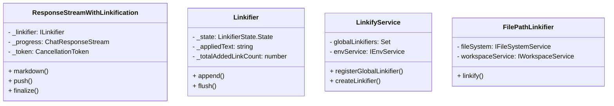
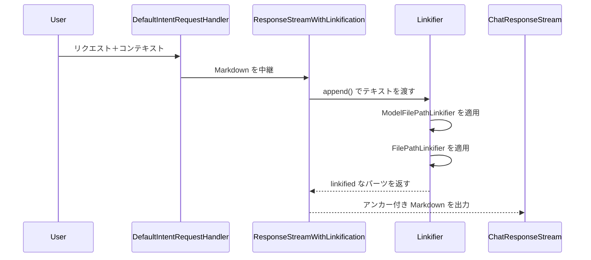

前の回答に沿ってリンク化パイプラインを可視化します。

クラス図

ソース: [src/extension/linkify/common/responseStreamWithLinkification.ts](src/extension/linkify/common/responseStreamWithLinkification.ts#L13-L231), [src/extension/linkify/common/linkifier.ts](src/extension/linkify/common/linkifier.ts#L58-L307), [src/extension/linkify/common/linkifyService.ts](src/extension/linkify/common/linkifyService.ts#L79-L109), [src/extension/linkify/common/filePathLinkifier.ts](src/extension/linkify/common/filePathLinkifier.ts#L1-L86)

シーケンス図

ソース: [src/extension/prompt/node/defaultIntentRequestHandler.ts](src/extension/prompt/node/defaultIntentRequestHandler.ts#L234-L258), [src/extension/linkify/common/responseStreamWithLinkification.ts](src/extension/linkify/common/responseStreamWithLinkification.ts#L13-L229), [src/extension/linkify/common/linkifier.ts](src/extension/linkify/common/linkifier.ts#L58-L307), [src/extension/linkify/common/linkifyService.ts](src/extension/linkify/common/linkifyService.ts#L79-L109), [src/extension/linkify/common/filePathLinkifier.ts](src/extension/linkify/common/filePathLinkifier.ts#L1-L86), [src/extension/linkify/common/modelFilePathLinkifier.ts](src/extension/linkify/common/modelFilePathLinkifier.ts#L1-L179)
